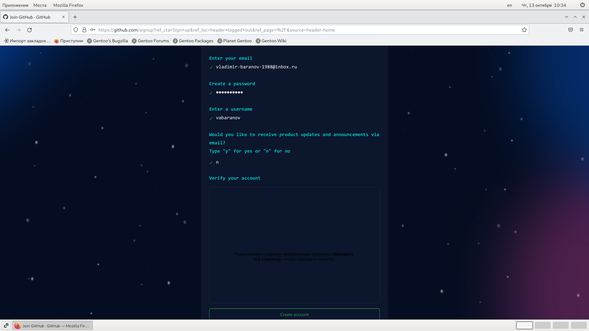

---
## Front matter
title: "lab-03"
subtitle: "Система контроля версий Git"
author: "Владимир Андреевич Баранов"

## Generic otions
lang: ru-RU
toc-title: "Содержание"

## Bibliography
bibliography: bib/cite.bib
csl: pandoc/csl/gost-r-7-0-5-2008-numeric.csl

## Pdf output format
toc: true # Table of contents
toc-depth: 2
lof: true # List of figures
lot: true # List of tables
fontsize: 12pt
linestretch: 1.5
papersize: a4
documentclass: scrreprt
## I18n polyglossia
polyglossia-lang:
  name: russian
  options:
	- spelling=modern
	- babelshorthands=true
polyglossia-otherlangs:
  name: english
## I18n babel
babel-lang: russian
babel-otherlangs: english
## Fonts
mainfont: PT Serif
romanfont: PT Serif
sansfont: PT Sans
monofont: PT Mono
mainfontoptions: Ligatures=TeX
romanfontoptions: Ligatures=TeX
sansfontoptions: Ligatures=TeX,Scale=MatchLowercase
monofontoptions: Scale=MatchLowercase,Scale=0.9
## Biblatex
biblatex: true
biblio-style: "gost-numeric"
biblatexoptions:
  - parentracker=true
  - backend=biber
  - hyperref=auto
  - language=auto
  - autolang=other*
  - citestyle=gost-numeric
## Pandoc-crossref LaTeX customization
figureTitle: "Рис."
tableTitle: "Таблица"
listingTitle: "Листинг"
lofTitle: "Список иллюстраций"
lotTitle: "Список таблиц"
lolTitle: "Листинги"
## Misc options
indent: true
header-includes:
  - \usepackage{indentfirst}
  - \usepackage{float} # keep figures where there are in the text
  - \floatplacement{figure}{H} # keep figures where there are in the text
---

# Цель работы
Целью работы является изучить идеологию
и применение средств контроля верси .
Приобрести практические навыки по работе
с системо git.

# Выполнение лабораторной работы
1) Настройка Github.
1.1. Создаю учетную запись на сайте https://github.com/ и заполняю
основные данные (рис. [-@fig:001]).

{ #fig:001 width=90% }

2) Базовая настройка git.
2.1. Открываю терминал и ввожу следующие команды, указав имя и email
владельца репозитория, а также настраиваю utf-8 в выводе сообщени git (рис. [-@fig:002]).

![]image/Снимок экрана от 2022-10-13 11-20-13.png{ #fig:002 width=90% }

2.2. Задаю имя начальной ветки и параметры autocrlf и safecrlf (рис. [-@fig:003]).

![Название рисунка]image/Снимок экрана от 2022-10-13 11-20-35.png{ #fig:003 width=90% }

3) Создание SSH ключа.
3.1. Генерирую пару ключей (приватный и открытый ). Далее загружаю
сгенер нны открыты ключ.

![Название рисунка]image/Снимок экрана от 2022-10-13 11-29-18.png{ #fig:004 width=90% }
![Название рисунка]image/index2.png{ #fig:005 width=70% }

4) Создание рабочего пространства и
репозитория курса на основе шаблона.
4.1. Открываю терминал и создаю каталог для предмета «Архитектура
компьютера».

![Название рисунка]image/Снимок экрана от 2022-10-13 11-30-47.png{ #fig:001 width=90% }

5) Создание репозитория курса на основе
шаблона.
5.1. Перехожу на станицу репозитория с шаблоном курса https://
github.com/yamadharma/course-directory-student-template. Далее
выбераю Use this template.В открывшемся окне задаю имя репозитория и
создаю репозитори.

![Название рисунка]image/Снимок экрана от 2022-10-13 12-13-14.png{ #fig:001 width=90% }

5.2. Открываю терминал и клонирую созданный репозиторий.

![Название рисунка]image/Снимок экрана от 2022-10-13 12-36-15.png{ #fig:001 width=90% }

6) Настройка каталога курса.
6.1. Перехожу в каталог курса и удаляю лишние файлы.

![Название рисунка]image/Снимок экрана от 2022-10-13 12-52-41.png{ #fig:001 width=90% }

6.2. Создаю необходимые каталоги и отправляю файлы на сервер.

![Название рисунка]image/Снимок экрана от 2022-10-13 13-44-59.png{ #fig:001 width=90% }
![Название рисунка]image/Снимок экрана от 2022-10-13 13-45-28.png{ #fig:001 width=90% }

{ #fig:001 width=90% }

# Выводы
В рамках данно лабораторно работы я
изучил идеологию и применение средств
контроля верси , а также приобрел
практические навыки по работе с системо
git.
