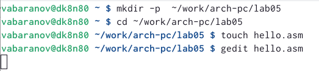
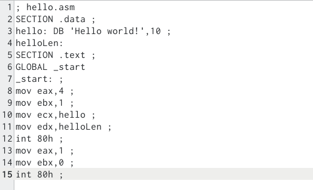
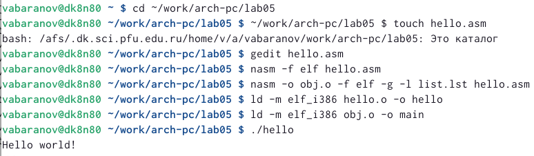
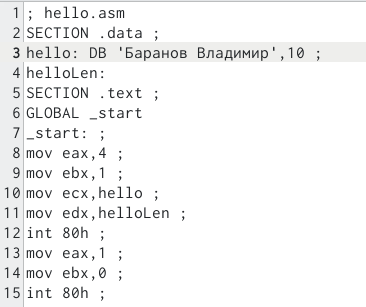
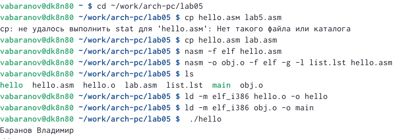
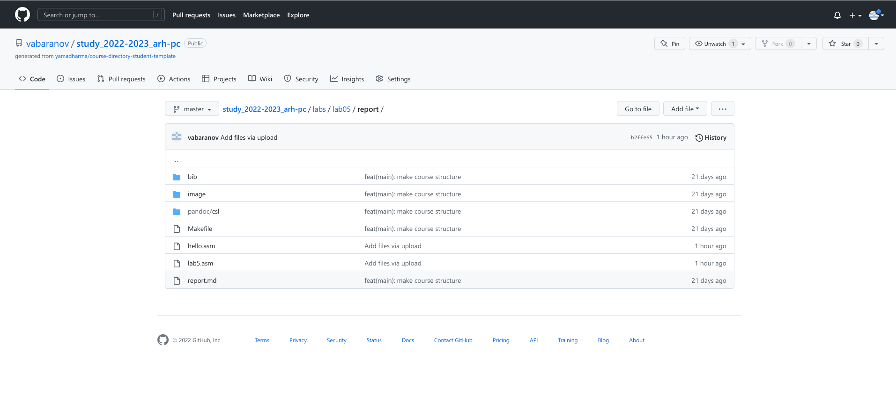

---
## Front matter

title: "lab-05"
subtitle: "Создание и процесс обработки программ на языке ассемблера NASM"
author: "Владимир Андреевич Баранов"

## Generic otions

lang: ru-RU
toc-title: "Содержание"

## Bibliography

bibliography: bib/cite.bib
csl: pandoc/csl/gost-r-7-0-5-2008-numeric.csl

## Pdf output format

toc: true # Table of contents
toc-depth: 2
lof: true # List of figures
lot: true # List of tables
fontsize: 12pt
linestretch: 1.5
papersize: a4
documentclass: scrreprt

## I18n polyglossia

polyglossia-lang:
  name: russian
  options:
	- spelling=modern
	- babelshorthands=true
polyglossia-otherlangs:
  name: english

## I18n babel

babel-lang: russian
babel-otherlangs: english

## Fonts

mainfont: PT Serif
romanfont: PT Serif
sansfont: PT Sans
monofont: PT Mono
mainfontoptions: Ligatures=TeX
romanfontoptions: Ligatures=TeX
sansfontoptions: Ligatures=TeX,Scale=MatchLowercase
monofontoptions: Scale=MatchLowercase,Scale=0.9

## Biblatex

biblatex: true
biblio-style: "gost-numeric"
biblatexoptions:
  - parentracker=true
  - backend=biber
  - hyperref=auto
  - language=auto
  - autolang=other*
  - citestyle=gost-numeric

## Pandoc-crossref LaTeX customization

figureTitle: "Рис."
tableTitle: "Таблица"
listingTitle: "Листинг"
lofTitle: "Список иллюстраций"
lotTitle: "Список таблиц"
lolTitle: "Листинги"

## Misc options

indent: true
header-includes:
  - \usepackage{indentfirst}
  - \usepackage{float} # keep figures where there are in the text
  - \floatplacement{figure}{H} # keep figures where there are in the text
---

# Цель работы

Целью работы является освоение процедуры компиляции и сборки программ, написанных на ассемблере NASM.

# Выполнение лабораторной работы

1. Создаю каталог для работы с программами на языке ассемблера NASM. (рис. [-@fig:001])

{ #fig:001 width=90% }

2. Открываю этот файл с помощью текстового редактора gedit и ввожу в него следующий текст. (рис. [-@fig:002]).

{ #fig:002 width=90% }

3. Выполняю ряд команд:
Выполняю компиляцию приведенного выше текста.
Выполняю команду, чтобы скомпилировать исходный файл hello.asm в obj.o.
Выполняю команду, чтобы получить исполняемую программу. Выполняю команду, которая задаёт имя создаваемого исполняемого файла. 
Выполняю команду, чтобы запустить на выполнение созданный исполняемый файл, находящийся в текущем каталоге.
(рис. [-@fig:003]).

{ #fig:003 width=90% }

4. Задание для самостоятельной работы.

1) В каталоге ~/work/arch-pc/lab05 создаю копию файла hello.asm с именем lab5.asm. 

2) С помощью любого текстового редактора вношу изменения в текст программы в файле lab5.asm. (рис. [-@fig:004]).

{ #fig:004 width=90% }

3) Оттранслирую полученный текст программы lab5.asm в объектный файл. Выполнияю компоновку объектного файла и запускаю получившийся исполняемый файл. (рис. [-@fig:005]).

{ #fig:005 width=90% }

4) Копирую файлы hello.asm и lab5.asm в мой локальный репозиторий, загружаю файлы на Github.(рис. [-@fig:006]).

{ #fig:006 width=90% }

# Выводы

В ходе данной лабараторной работы я освоил процедуры компиляции и сборки программ, написанных на ассемблере NASM.

